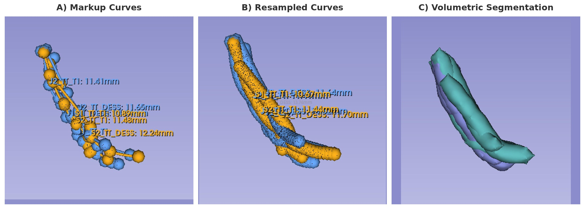

# Curve Segmentation Comparison Tool for 3D Slicer

A Python tool for quantitative assessment of interobserver segmentation reproducibility in 3D Slicer. Originally developed for evaluating manual segmentation of the intraparotid facial nerve on neurographic MRI sequences.

## Overview



**A)** Input markup curves from multiple observers loaded into 3D Slicer. **B)** After running the script, curves are resampled at equidistant points to compute interobserver distance metrics. **C)** Volumetric segmentation generated for 3D visualization of the nerve paths.

## Features

- **Pairwise interobserver comparison**: Calculates distance-based error metrics between all pairs of segmenters
- **Condition comparison**: Compares segmentations across different imaging sequences/conditions
- **Automatic curve detection**: Can auto-detect curves in the scene or use predefined lists
- **Flexible naming conventions**: Supports multiple naming patterns for curve nodes
- **3D visualization**: Generates tube models for visual inspection of segmentations
- **Comprehensive metrics**: 
  - Mean error distance
  - Maximum error distance
  - Median error (50th percentile)
  - 75th and 95th percentile errors
  - Curve length differences

## Requirements

- **3D Slicer** version 5.0 or higher
- **MarkupsToModel extension** (install via Extension Manager)
- Python packages (included with 3D Slicer):
  - NumPy
  - Pandas

## Installation

1. Download `curve_segmentation_comparison.py`
2. Open 3D Slicer
3. Load your markup curve segmentations
4. Open the Python Interactor (View → Python Interactor)
5. Run the script or copy/paste into the console

## Usage

### Quick Start

1. **Prepare your curves**: Load all markup curve nodes into 3D Slicer. Name them consistently using a pattern like:
   - `Observer1_Trunk_T1`
   - `Observer1_Trunk_DESS`
   - `Observer2_Trunk_T1`
   - etc.

2. **Configure the script**: Edit the CONFIGURATION section at the top of the script:

```python
# Output directory
OUTPUT_DIR = '/path/to/your/output/'

# Define your study parameters (or set to None for auto-detection)
OBSERVERS = ['Observer1', 'Observer2', 'Observer3', 'Observer4']
STRUCTURES = ['Trunk', 'SuperiorDivision', 'InferiorDivision']
CONDITIONS = ['T1', 'DESS']

# Naming pattern
NAMING_PATTERN = 'observer_structure_condition'
NAME_SEPARATOR = '_'
```

3. **Run the analysis**:
```python
exec(open('/path/to/curve_segmentation_comparison.py').read())
```

Or in the Python console:
```python
run_analysis()
```

### Naming Conventions

The script supports several naming patterns:

| Pattern | Example |
|---------|---------|
| `observer_structure_condition` | `Observer1_Trunk_T1` |
| `structure_observer_condition` | `Trunk_Observer1_T1` |
| `condition_observer_structure` | `T1_Observer1_Trunk` |

### Auto-Detection Mode

Set `OBSERVERS`, `STRUCTURES`, and/or `CONDITIONS` to `None` to automatically detect values from curve names in the scene:

```python
OBSERVERS = None  # Auto-detect from scene
STRUCTURES = None  # Auto-detect from scene
CONDITIONS = ['T1', 'DESS']  # Manually specified
```

## Output Files

The script generates CSV files with timestamps:

| File | Description |
|------|-------------|
| `interobserver_comparison_YYYYMMDD_HHMMSS.csv` | Pairwise error metrics between all observers |
| `condition_comparison_YYYYMMDD_HHMMSS.csv` | Comparison across imaging conditions |
| `missing_curves_YYYYMMDD_HHMMSS.csv` | List of expected but not found curves |

### Output Metrics

| Metric | Description |
|--------|-------------|
| Mean Error (mm) | Average distance between corresponding curve points |
| Max Error (mm) | Maximum distance between any pair of points |
| Median Error (mm) | 50th percentile of distances |
| P75 Error (mm) | 75th percentile of distances |
| P95 Error (mm) | 95th percentile of distances |
| Length Difference (mm) | Absolute difference in total curve length |

## Method

The algorithm works as follows:

1. **Curve resampling**: Both curves are resampled at uniform intervals (default: 1 mm) using `ResampleCurveWorld()`

2. **Point-wise distance calculation**: For each control point on curve 1, the closest point on curve 2 is found using `GetClosestPointPositionAlongCurveWorld()`

3. **Distance computation**: The Euclidean distance between each point pair is calculated

4. **Statistical summary**: Mean, max, median, and percentile statistics are computed from all distances

## Example

```python
# Example configuration for facial nerve study
OUTPUT_DIR = '/home/user/nerve_study/results/'

OBSERVERS = ['Radiologist1', 'Radiologist2', 'Trainee1', 'Trainee2']
STRUCTURES = ['Trunk_Healthy', 'Trunk_Tumor', 'Superior_Healthy', 'Superior_Tumor', 
              'Inferior_Healthy', 'Inferior_Tumor']
CONDITIONS = ['T1_Gd', 'DESS']

NAMING_PATTERN = 'observer_structure_condition'
NAME_SEPARATOR = '_'
RESAMPLE_INTERVAL_MM = 1.0
GENERATE_TUBE_MODELS = True
```

## License

MIT
